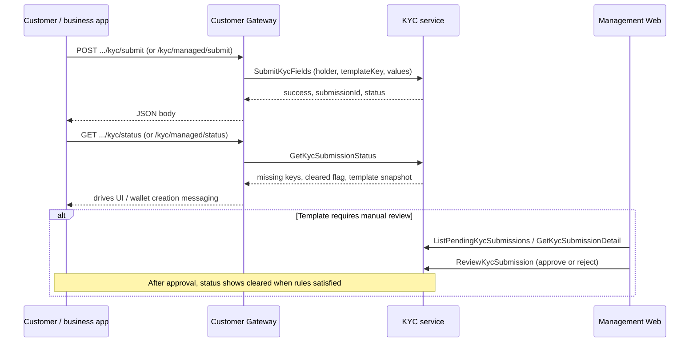

# KYC flow, validation, dynamic behaviour, and portal approval

This page describes how **MITF Wallet** handles **Know Your Customer (KYC)** end to end: reusable **field definitions**, **templates** that bind fields with rules, **submissions** per user and template, **validation** on capture, **dynamic** coupling to **wallet classifications** and the **Customer Gateway**, and **staff approval** in **Gateway Management Web** (the bank operator portal).

For **which programme** collects KYC (consumer vs corporate, including employer-led capture for staff), see [Resident and foreign customers: retail vs corporate programmes](./resident-and-foreign-gateway-personas.md). For **Users** `KycStatus` vs per-template state, see the **mitf_wallet** note `docs/solutions/kyc-user-status-vs-template.md`.

---

## Two surfaces

| Surface | Role | Typical users |
| ------- | ---- | ------------- |
| **Customer Gateway** (`Masarat.Gateway.Customer.Api`) | Collects field values from **mobile / partner apps**; calls **KYC** gRPC with the **holder** user id. | Customers, business operators (self or **managed** employee). |
| **Gateway Management Web** (`Masarat.Gateway.Management.Web`) | **Configures** templates and field definitions; **lists** pending submissions; **approves** or **rejects** when manual review is required. | Bank **Viewer** (read), **Operator** / **Admin** (mutations + review). |

Apps **do not** approve submissions — they only **submit** and **poll status**. The portal is the **human review** lane when the product marks a template as needing manual review.

---

## Data model: what is static vs dynamic

### Field definitions (catalog)

- **Global dictionary** of fields: **key**, label, **data type** (`String`, `Date`, `Number`, `Boolean`), and **sensitive** flag.
- Managed in the portal under **KYC field definitions** (`/kyc-fields`). New products add fields once; many templates can reuse the same field key.

### Templates (product-specific shape)

- A **template** has a stable **key** (e.g. `resident-standard`, `foreign-employer-issued`), display metadata, **`RequiresManualReview`**, **`IsActive`**, and **links** to field definitions with:
  - **required** vs optional on *this* template,
  - **sort order** for UI and docs.
- Managed under **KYC templates** (`/kyc-templates`, create/edit).

**Why call it “dynamic”:** Wallet **classifications** (configured in the same portal) point wallet products at **resident** vs **foreign** template keys and a **KYC capture mode**. When classification or template definitions change, **apps** see different `templateKey` requirements and **status** payloads without redeploying the gateway — only configuration and KYC data change.

### Submissions (runtime state)

- One logical **submission** row per **(holder user id, template id)** in the **KYC** service.
- Stores **merged** field values across multiple partial submits, **status**, and review metadata when staff act.

---

## End-to-end flow

---

## Submission lifecycle (status)

| Status | Meaning |
| ------ | ------- |
| **Pending** | Values may be partial or complete; if **`RequiresManualReview`** is true, auto-approval never runs — stays **Pending** until staff review. |
| **Approved** | Submission accepted (either **auto-approved** when all required fields are present and the template does **not** require manual review, or **after** staff approval). |
| **Rejected** | Staff rejected the submission; reason stored for audit. |

Only **Pending** submissions can receive **ReviewKycSubmission** from the portal; attempts to review a terminal state return an error.

---

## Validation on submit (KYC service)

When **SubmitKycFields** runs, the service (conceptually):

1. **Template key** — non-empty; template must **exist**.
2. **Active template** — if **`IsActive`** is false, submit is **rejected** (no new data on deprecated templates).
3. **Field keys** — every submitted key must belong to the template’s linked fields; unknown keys are rejected with a clear message.
4. **First save** — at least one value is required when no row exists yet.
5. **Merge** — new values overlay prior stored values for the same submission.
6. **Data types** — non-empty values are checked per field definition (**number** uses invariant parsing, **date** parses common formats, **boolean** accepts standard literals and common yes/no forms).
7. **Required completeness** — after merge, all template-required fields must be non-whitespace to **auto-approve** (when manual review is off).

If validation fails, the client receives **`success: false`** and an **`error`** string suitable for display or logs.

---

## Status query (dynamic for integrators)

**GetKycSubmissionStatus** (exposed through the gateway as **`GET .../kyc/status`** and **`GET .../kyc/managed/status`**) returns:

- **`template`** snapshot — fields, types, required flags, **`isActive`** (so apps can grey out inactive products).
- **`missingFieldKeys`** / **`presentFieldKeys`** — derived from required flags vs non-empty stored values.
- **`kycCleared`** — **`true`** only when the submission is **Approved** **and** the template is still **active**. Inactive templates **never** clear KYC for downstream gates, even if an old row was approved (prevents deprecated templates from unlocking wallets).

---

## Gateway coupling to wallets (“dynamic” product behaviour)

When the gateway **creates a wallet** or evaluates provisioning, it resolves the **KYC template key** from the **wallet classification** (resident vs foreign template columns) and the holder’s **type**, then calls the KYC service.

**`WalletKycCaptureMode`** on the classification controls how strict the gateway is:

- **`RequireAtCreation`** — missing or uncleared KYC yields a **blocking** outcome (`missing_kyc`); wallet creation may be refused until data or approval clears the template path.
- **Deferred modes** — the wallet may be created with a softer **`pending_kyc`** state so the user can finish KYC after the fact (exact UX depends on template and capture mode).

The gateway also treats the **Users** coarse **`KycStatus`** field as a **shortcut**: if it is already **`Approved`**, the resolver may treat KYC as **complete** without calling KYC for that check — integrators should still rely on **template submission** for accuracy where both exist.

---

## Portal: where staff work

All routes below are on **Gateway Management Web** (Blazor). Access uses **ASP.NET Core Identity** roles; **KYC review** mutations require **Operator** or **Admin** (viewers can browse where the UI allows).

| Route | Purpose |
| ----- | ------- |
| **`/kyc-review`** | **Queue** of pending submissions (`ListPendingKycSubmissions`); open a row for **detail** (`GetKycSubmissionDetail`); **Approve** or **Reject** (`ReviewKycSubmission`). Sensitive field values are **masked** in the UI. |
| **`/kyc-templates`** | List/create/edit **templates** — keys, manual review flag, active flag, linked fields and required/sort order. |
| **`/kyc-fields`** | Maintain **global field definitions** (keys, labels, data types, sensitive). |

Successful **approve** / **reject** actions append **staff audit** events (KYC submission entity) for later investigation alongside wallet and transaction audits.

---

## Notifications (optional in deployment)

When a submission lands in **Pending** and the product expects back-office workload, the **KYC** service can emit a **queued** notification (e.g. MassTransit) so other workers or dashboards can pick it up. Whether that is enabled depends on **mitf_wallet** infrastructure configuration — the **portal queue** still polls **list pending** for operators.

---

## Integrator quick reference

| Goal | Call |
| ---- | ---- |
| Discover required fields | `GET .../kyc/status?templateKey=...` (or managed variant with `holderUserId`). |
| Save partial progress | `POST .../kyc/submit` with a subset of keys; repeat until `missingFieldKeys` is empty. |
| Know if wallet can proceed | Use gateway wallet-creation response / provisioning docs — depends on **`kycCleared`** and capture mode. |
| Staff decision | Use **Management Web** `/kyc-review`, not a public REST route on the customer gateway. |

---

## Related pages

| Topic | Link |
| ----- | ---- |
| Retail vs corporate KYC entry points | [Resident and foreign customers: retail vs corporate programmes](./resident-and-foreign-gateway-personas.md) |
| KYC gRPC reference | [KYC API service reference](../reference/service-reference/Masarat.Kyc.Api.reference.md) |
| Management portal host | [Gateway Management Web service reference](../reference/service-reference/Masarat.Gateway.Management.Web.reference.md) |
| Onboarding and abuse | [Onboarding channel hardening](../security/onboarding-channel-hardening.md) |
