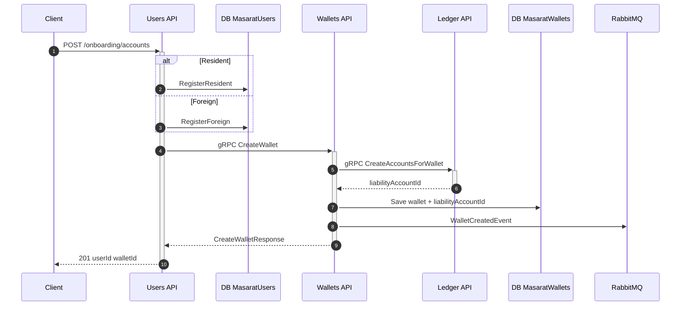
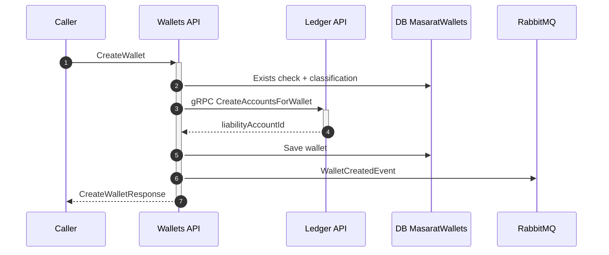
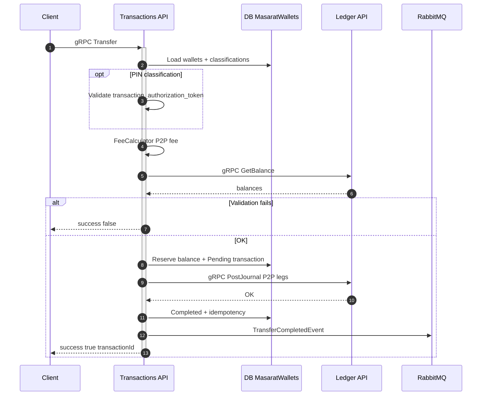
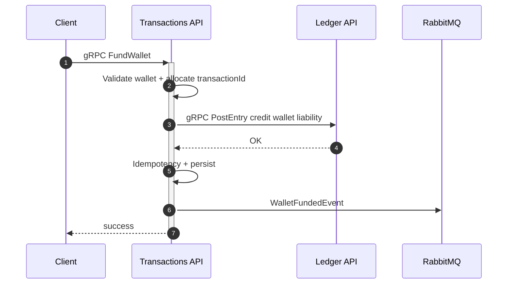
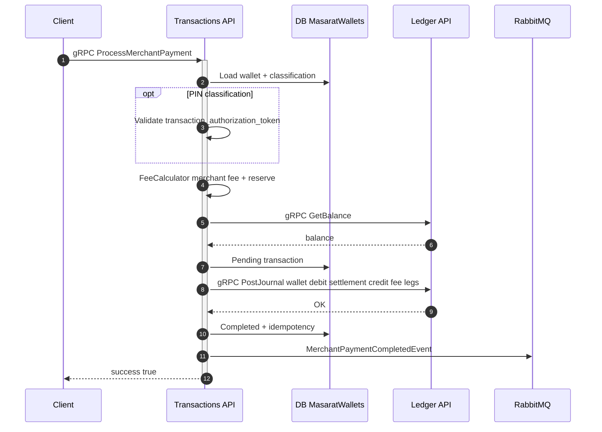
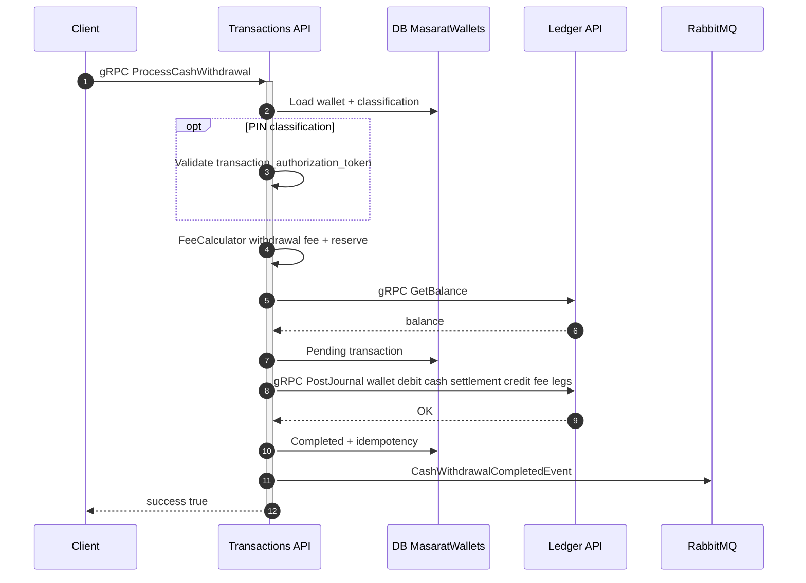
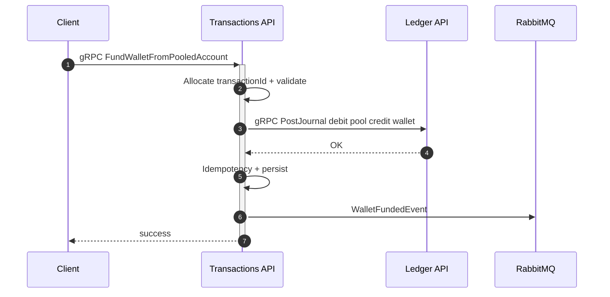
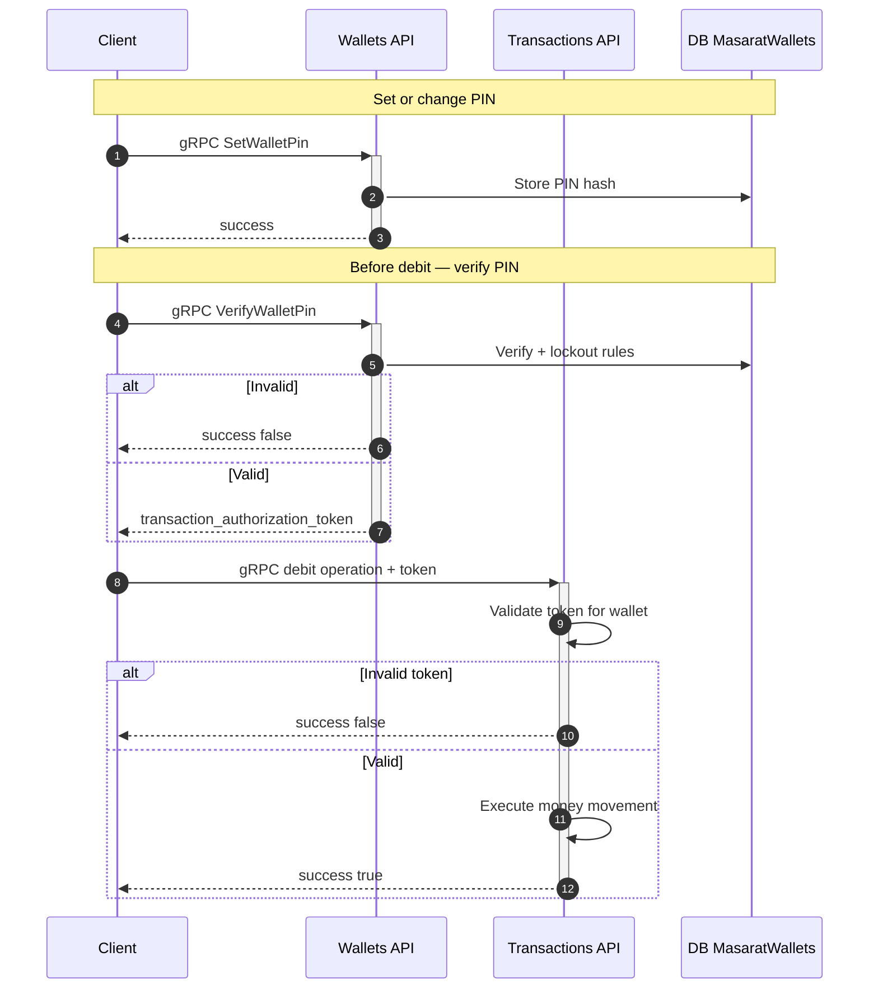
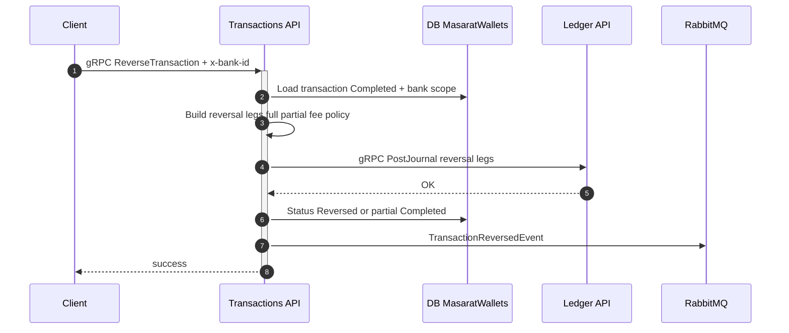

# Money movement — sequence diagrams

Sequence diagrams for every financial journey. Complements [Transaction flows & ledger examples](transaction-flows-and-ledger-examples.md) and [Financial operations & reconciliation](../reconciliation/financial-operations-and-reconciliation.md).

**Source alignment:** diagrams follow the **Key Flows** section in the main `mitf_wallet` repository README.

---

## 1. Onboarding — register user and create wallet

---

## 2. Wallet creation (direct call)

---

## 3. P2P transfer (wallet to wallet)

`Transfer` on **Transactions API**: balance and fee rules, optional `transaction_authorization_token` when classification requires PIN.

---

## 4. Fund wallet (top-up)

**FundWallet**: single `PostEntry` — credit to the wallet liability. Bank/current account debit is external.

---

## 5. Merchant payment

**ProcessMerchantPayment**: debit customer wallet, credit merchant settlement (+ fee revenue leg when configured).

---

## 6. Cash withdrawal

**ProcessCashWithdrawal**: debit wallet, credit cash settlement (+ optional fee leg).

---

## 7. Fund wallet from pooled account

**FundWalletFromPooledAccount**: `PostJournal` debits pool liability, credits wallet liability.

---

## 8. Wallet PIN and transaction authorization

Applies before **Transfer**, **ProcessMerchantPayment**, and **ProcessCashWithdrawal** when `OperationAuthMode` requires user PIN.

---

## 9. Reverse transaction

**ReverseTransaction** posts a balancing `PostJournal` for a Completed transaction. FundWallet and FundFromPool are **not** reversible through this API.

---

## Diagram index

| Flow | API / entry | Ledger call | Domain event |
| ---- | ----------- | ----------- | ------------ |
| Onboarding | Users `POST /onboarding/accounts` | CreateAccountsForWallet | WalletCreatedEvent (from Wallets) |
| Create wallet | Wallets CreateWallet | CreateAccountsForWallet | WalletCreatedEvent |
| P2P | Transactions Transfer | PostJournal | TransferCompletedEvent |
| Fund wallet | Transactions FundWallet | PostEntry | WalletFundedEvent |
| Merchant | Transactions ProcessMerchantPayment | PostJournal | MerchantPaymentCompletedEvent |
| Cash out | Transactions ProcessCashWithdrawal | PostJournal | CashWithdrawalCompletedEvent |
| Pool → wallet | Transactions FundWalletFromPooledAccount | PostJournal | WalletFundedEvent |
| Reversal | Transactions ReverseTransaction | PostJournal | TransactionReversedEvent |

---

- [Financial operations & reconciliation](../reconciliation/financial-operations-and-reconciliation.md)
- [Transaction flows & ledger examples](transaction-flows-and-ledger-examples.md)
- [Domain events](events.md)
- [gRPC reference](../reference/grpc-services.md)
