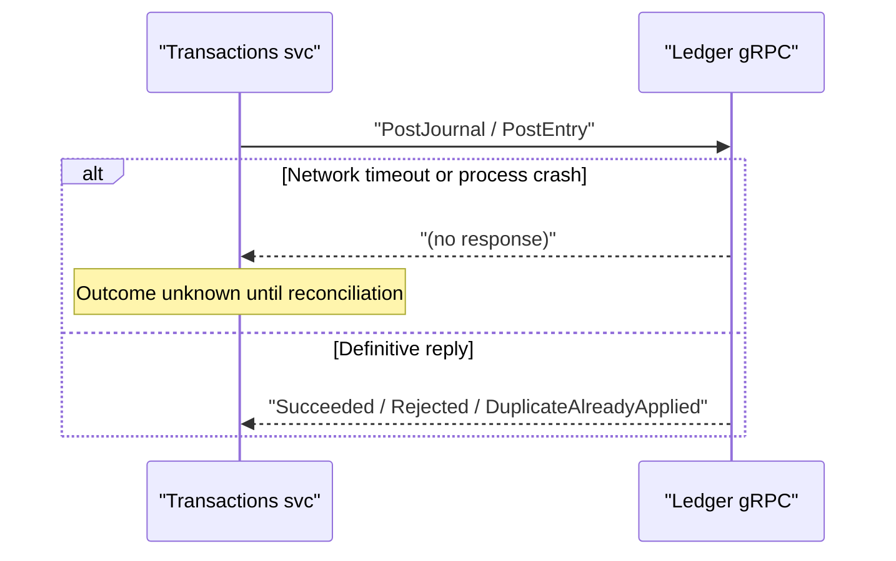

# Outbox and Ledger Consistency Contract

Phase-1 consistency model for wallet, transaction, and ledger flows. Makes delivery and recovery rules explicit for engineers and operators.

**Wallets** and **Transactions** use MassTransit **EF Core transactional outbox** (PostgreSQL), aligning local commits with outbound message durability. Ledger gRPC calls remain **outside** those local transactions; the outcome classification and recovery tables below still apply when RPC results are ambiguous.

## Scope

- Local database writes and outgoing broker messages inside a single service boundary.
- Consumer deduplication and downstream idempotency requirements.
- Ledger RPC outcomes and the recovery path when outcome is ambiguous.
- Async transaction request acceptance and status truthfulness.

## Non-goals

- Does not redesign customer gateway contracts in phase 1.
- Does not make ledger RPC calls part of the local database transaction.
- Does not replace bank-statement reconciliation described in `reconciliation/reconciliation.md`.

## Outbox → broker → consumer (happy path)

```mermaid
sequenceDiagram
  autonumber
  participant App
  participant DB
  participant OB
  participant Q
  participant C

  App->>DB: "BEGIN; business rows + outbox rows"
  App->>DB: "COMMIT"
  OB->>DB: "Read undispatched outbox"
  OB->>Q: "Publish message"
  OB->>DB: "Mark dispatched"
  Q->>C: "Deliver (at-least-once)"
  C->>C: "Inbox + domain idempotency"
  C->>DB: "Apply side-effects once"
```

> **Lifelines:** **App** = service handler, **DB** = PostgreSQL, **OB** = outbox dispatcher, **Q** = broker (RabbitMQ), **C** = consumer.

## Ledger RPC outside the local DB transaction



## Boundary Guarantees

| Boundary | Phase-1 guarantee | Notes |
| -------- | ----------------- | ----- |
| Local business rows + outbox rows | Atomic inside one local database transaction | Business state, idempotency rows, and outgoing messages commit or roll back together |
| Outbox to broker | At-least-once delivery | Dispatch can be delayed or retried; consumers must tolerate duplicates |
| Broker to consumers | At-least-once delivery | Inbox retention reduces duplicate handling pressure but is not the only guard |
| Consumer side-effects with money or balances | Idempotent beyond inbox retention window | Defense in depth requires a domain-level guard where duplicate delivery would change balances |
| Local database to Ledger RPC | Not atomic | Ledger writes are external to the local transaction; require explicit reconciliation for ambiguous outcomes |
| Async request acceptance | "Durably queued locally" | Acceptance means request-status row and command intent were stored locally, not that the command was dispatched to RabbitMQ |

## Request State Model

| State | Terminal | Public | Meaning |
| ----- | -------- | ------ | ------- |
| `AcceptedLocally` | No | Yes (as `Queued`) | Request durably stored in local DB; outbox dispatch has not yet occurred |
| `Queued` | No | Yes | Request accepted locally and waiting for dispatch or execution |
| `Processing` | No | Yes | Consumer or handler has started work |
| `Succeeded` | Yes | Yes | Local and remote effects confirmed complete |
| `Failed` | Yes | Yes | Request known to have failed; no further automatic repair |
| `UnknownNeedsReconciliation` | Yes | No | Cannot prove whether ledger or side-effects succeeded; must be repaired by reconciliation or manual review |

`AcceptedLocally` and `Queued` both map to public `Queued`. `UnknownNeedsReconciliation` is internal/operator-facing only; it must not change the gateway status enum or break existing polling clients.

## Ledger Outcome Classification

| Classification | Meaning | Caller action |
| -------------- | ------- | ------------- |
| `Succeeded` | Ledger confirmed the write | Mark the business flow successful |
| `DuplicateAlreadyApplied` | Prior ledger attempt may already have succeeded | Do not treat as automatic failure; verify prior effect or hand off to reconciliation |
| `Rejected` | Ledger definitively rejected for business or validation reason | Mark failed and stop |
| `TransientFailure` | Retryable infrastructure failure | Retry within policy; escalate to reconciliation if still ambiguous |
| `Unknown` | Timeout, transport loss, or process death | Persist internal unknown outcome; let reconciliation determine final state |

## Recovery Ownership

| Scenario | Primary owner | Expected action |
| -------- | ------------- | --------------- |
| Local validation failure before any durable write | Synchronous handler | Return a validation or business error |
| Local transaction fails before commit | Synchronous handler | Return an error; leave no durable queued work |
| Local commit succeeds but broker is unavailable | Outbox dispatcher | Retry dispatch from outbox |
| Duplicate broker delivery to a consumer | Consumer inbox + domain idempotency | Accept replay safely without double side-effects |
| Ledger duplicate response after earlier probable success | Synchronous handler, then reconciliation | Verify prior effect if possible; otherwise record unknown and reconcile |
| Ledger timeout or transport loss | Reconciliation worker | Query ledger by transaction key, repair local status, republish missing domain events |
| Local commit fails after ledger success | Reconciliation worker | Reconstruct or repair missing local state; escalate if ambiguous |
| Orphaned ledger account after wallet or pool creation | Reconciliation worker | Recreate missing local state when safe; raise manual intervention otherwise |
| Ambiguous high-risk money movement | Manual operations + reconciliation support | Escalate when deterministic repair is not safe |

## Header and Contract Preservation

Phase 1 preserves these operational headers when Transactions enqueues async commands:

- `x-request-id`
- `x-enqueued-at-utc`
- `x-operation-type`
- `x-bank-id`

Moving publish to the outbox must preserve these headers end-to-end.

## Relationship to Existing Reconciliation

The reconciliation flow in `reconciliation/reconciliation.md` compares ledger exports against bank statements. The consistency work here adds a separate **internal consistency path** reconciling local service state against ledger truth. These solve different failure modes and remain separate.

## Phase-1 Contract for External Clients

- Customer gateway request and response shapes stay unchanged.
- Public async statuses remain `Queued`, `Processing`, `Succeeded`, and `Failed`.
- Any richer recovery state remains internal until there is a deliberate backward-compatible external design.

## Implementation Alignment

### Aligned

- **Transactional outbox:** `Masarat.Wallets.Api` and `Masarat.Transactions.Api` register `AddEntityFrameworkOutbox` with Postgres.
- **Ledger outcome enum:** `LedgerSubmissionOutcome` matches the classification table.
- **Duplicate / unknown → reconciliation:** `LedgerDuplicateRecovery.RequiresReconciliation` treats these as needing reconciliation.
- **Internal state `UnknownNeedsReconciliation`:** Persisted on `TransactionRequestStatus`; maps to public `Queued` for polling clients.
- **Async enqueue headers:** `TransactionGrpcService` sets all four headers on publish.
- **Reconciliation worker:** `InternalConsistencyWorker` loads stuck requests, resolves `transactionId`, calls ledger `GetEntriesByTransaction`, repairs local state, and records runs in the reconciliation DB.
- **Pending transaction repair:** `PendingTransactionRepairService` scans old `Pending` transactions, confirms ledger entries, and completes local state.
- **Ledger consumer idempotency:** `LedgerProcessedSnapshotEvents` for processed snapshot deduplication.

### Partially aligned

- **Recovery event republishing:** `PendingTransactionRepairService` publishes through the EF Core outbox (atomic). `InternalConsistencyRunner` publishes directly to RabbitMQ (best-effort; repair still commits if broker is unavailable).
- **Orphaned ledger accounts:** `OrphanedLedgerAccountDetectionService` cross-checks recently-created accounts against local wallet rows. When `CreateWallet` is retried with the same idempotency key, `CreateWalletHandler` derives a stable wallet id so `DuplicateAlreadyApplied` can self-heal the missing local commit.
- **Deferred-snapshot verification:** `DeferredSnapshotVerificationService` periodically compares snapshot balances against `SUM(entries)` for deferred accounts. Interval: `Ledger:DeferredSnapshotVerificationIntervalSeconds`.

## Backlog

### P4 — Documentation and future design

- [ ] **Message ordering stance:** add an explicit statement (per aggregate vs global none) for outbox + competing consumers so multi-step sagas are not assumed to be FIFO.
- [ ] **Optional external visibility:** backward-compatible additive API for "needs attention" / reconciliation state without breaking existing enums.
