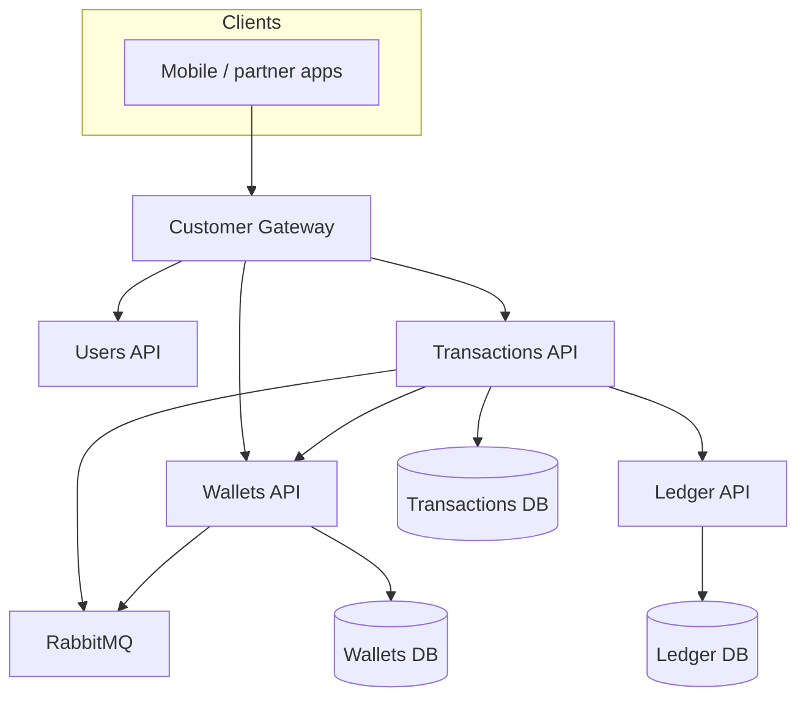

# Platform capabilities (consistency, durability, security)

Summarizes what the codebase and runtime actually provide today. Use with [Outbox and ledger consistency](outbox-and-ledger-consistency.md) for delivery semantics and recovery ownership.

## Service map

!!! tip "Async paths"
    Many money movements are **queued** then completed via consumers — see [Domain events](events.md).

---

## 1. Financial correctness

| Capability | Where it shows up |
| ---------- | ----------------- |
| **Double-entry invariant** | `PostJournal` requires sum of leg amounts = zero; currency must match each account |
| **Ledger entry idempotency** | Unique `IdempotencyKey` on `LedgerEntries`; gRPC returns `LedgerSubmissionOutcome` |
| **Atomic multi-leg journals** | One `PostJournal` applies all legs in a single handler transaction |
| **Balance snapshots** | `LedgerBalanceSnapshot` updated with postings; optional deferred accounts for hot paths |
| **Processed snapshot deduplication** | `LedgerProcessedSnapshotEvents` prevents double-apply of async snapshot side effects |
| **Orchestrated money flows** | Transactions validates wallets, classifications, fees, and balance before calling Ledger |
| **Reversal idempotency** | `ReverseTransactionIdempotency` rows prevent double-reverse on retries |

---

## 2. Messaging consistency and durability

| Capability | Where it shows up |
| ---------- | ----------------- |
| **Transactional outbox** | Wallets and Transactions use MassTransit EF Core outbox (PostgreSQL) — publish intent is durable in the same DB commit as business rows |
| **Consumer concurrency** | Configurable prefetch, retry intervals, and per-consumer concurrent limits |
| **Async command path** | High-volume flows queue to RabbitMQ; completion events drive ledger snapshot work and webhooks |
| **Explicit consistency contract** | [Outbox and ledger consistency](outbox-and-ledger-consistency.md) defines at-least-once delivery, inbox + domain idempotency, non-atomic ledger RPC, and `UnknownNeedsReconciliation` semantics |

---

## 3. Load protection and tail-latency control

| Capability | Where it shows up |
| ---------- | ----------------- |
| **Ledger ingress backpressure** | `LedgerConcurrencyGate` + options cap in-flight reads and writes; gRPC interceptor fails fast when saturated |
| **Transactions transfer gate** | `TransferConcurrencyGate` and `TransferBackpressureOptions` cap concurrent transfer work — see [transfer backpressure client contract](transfer-backpressure-client-contract.md) |
| **Hosted maintenance** | `PendingTransactionRepairService` and `IdempotencyRetentionCleanupService` reduce stuck or over-retained idempotency state |
| **Customer Gateway rate limits** | Partitioned limits (auth bootstrap, reads, transaction writes, operation status polling) |

---

## 4. Security and tenant isolation

| Capability | Where it shows up |
| ---------- | ----------------- |
| **API key auth** | Core APIs: REST middleware + gRPC interceptor; health routes excluded — [system hardening](../security/system-hardening.md) |
| **Bank-scoped context** | Transactions requires `x-bank-id`; shared `ApiCommon` carries actor/bank context into handlers |
| **Wallet PIN** | PBKDF2 hashing, lockout, optional short-lived transaction authorization token for debits when enforcement is enabled |
| **Customer Gateway** | Per-app credentials (`AppId` + API key), optional JWT for end-user identity, persona/app-type route filters, audit and correlation middleware |

---

## 5. Observability and production operations

| Capability | Where it shows up |
| ---------- | ----------------- |
| **OpenTelemetry** | Traces, metrics, logs to OTLP collector → Tempo, Prometheus, Loki; Grafana datasources |
| **Structured logging** | Serilog JSON; correlation IDs; gRPC call duration logging — [logging](../operations/logging.md) |
| **External configuration** | Optional Consul KV |
| **Reconciliation** | `Reconciliation.Job` exports ledger entries and matches to bank statements — [reconciliation](../reconciliation/reconciliation.md) |
| **Load and chaos testing** | Compose overlays under `compose/loadtest/`, `Masarat.LoadTest.Job` — [load test reference runs](../load-testing/load-test-reference-runs.md) |

---

## 6. Bounded contexts

| Service / worker | Persistence | Typical sync | Typical async |
| ---------------- | ----------- | ------------ | ------------- |
| **Ledger** | `MasaratLedger` | gRPC from Wallets/Transactions | Consumes completion events for snapshot updates |
| **Wallets** | `MasaratWallets` | gRPC | Outbox publish; inbox consumers |
| **Transactions** | Shared wallets DB + wallet reads | gRPC | Outbox + multiple command consumers |
| **Users** | `MasaratUsers` | REST + gRPC | MassTransit consumers |
| **Customer Gateway** | None (stateless) | HTTP to Users; gRPC to Wallets/Transactions | — |
| **LoadTest.Job** | — | gRPC and/or HTTP to gateway | — |
| **Reconciliation** | `MasaratReconciliation` | gRPC `ExportEntries` | Scheduled job |

---

## Related documentation

- [Financial operations and reconciliation](../reconciliation/financial-operations-and-reconciliation.md)
- [Production deployment](../operations/production-deployment.md)
- [Domain events](events.md)
