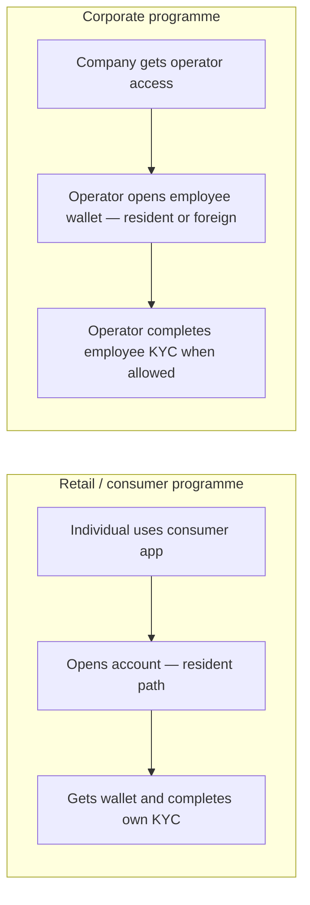

# Resident and foreign customers: retail vs corporate programmes

**Audience:** programme owners, product, compliance, and partner managers — without API specification detail.

MITF Wallet treats **retail customers** as **residents** onboarded through the **consumer** channel. **Foreign** individuals enter only through a **corporate-managed** relationship (e.g. an employee wallet), with KYC collected by the person themselves or by their employer's operator.

!!! tip "Need technical depth?"
    See [Customer Gateway service reference](../reference/service-reference/Masarat.Gateway.Customer.Api.reference.md), [KYC flow, validation & portal approval](./kyc-flow-validation-and-portal-approval.md), and the `mitf_wallet` repo's `personas-and-flows.md` for routes, headers, and payloads.

---

## Channel summary

| Market segment | Technical channel | Plain meaning | Foreign participants? |
| -------------- | ----------------- | ------------- | --------------------- |
| **Retail / individuals** | **Consumer** (`/v1/customer`) | Domestic-style residents: national ID–led onboarding, personal wallet, P2P, bills, cash-out | **No** — `CustomerType=Foreign` is rejected on this path |
| **Business / corporate** | **Business** (`/v1/business`) | Company operators: company wallets, employee wallets (resident or foreign), optional pooled liquidity | **Yes** — foreign individuals appear when the company adds them (e.g. employee) |
| **Foreign (non-resident) holders** | *Not a standalone retail sign-up* | Non-resident wallet owner, usually passport-led | Always tied to corporate context |

---

## Two customer-facing programmes

| Experience | Typical user | What the bank offers |
| ---------- | ------------ | --------------------- |
| **Consumer (retail) wallet** | Individual with a national ID–style identity | Personal wallet: save, send, pay, cash-out |
| **Corporate wallet** | Company staff running payroll or treasury | Operator access: company wallets, employee wallets, optional pooled liquidity |

**Merchant acceptance** is a third experience for taking payments; it does not include the employer-led KYC path.

---

## Glossary

| Term | Plain meaning | Why it matters |
| ---- | ------------- | -------------- |
| **Resident customer** | Domestic individual (national ID–led) | Who retail self-sign-up is built for |
| **Foreign holder** | Non-resident for that wallet (often passport-led) | Does not come from anonymous retail sign-up — appears when corporate adds them |
| **Wallet owner** | Person whose balance the wallet represents | Regulations and statements attach to this person |
| **Who opened the wallet** | Often the retail customer, or a corporate operator for an employee | Bank can grant ongoing management to the opener — typical for employer–employee setups |

---

## Platform rules (plain language)

1. **Retail onboarding creates residents only.** The consumer/corporate onboarding journey is not a back door for self-service foreign retail. The platform rejects `CustomerType=Foreign` on that path by design.

2. **Foreign individuals join through corporate.** When a company creates an employee wallet and marks the employee as foreign, that person is created through a business-controlled registration path, keeping foreign entry tied to programme and employer context.

3. **Who completes KYC depends on who is logged in.** On the consumer app, the person completes their own KYC. On the corporate app, the operator can complete KYC for an employee wallet they legitimately manage — so a foreign worker is not blocked because they lack access to a consumer app.

4. **Bank staff still review when required.** Templates can require manual approval in the Management Web portal.

---

## Journey overview

---

## Product conversation reference

| Topic | Consumer programme | Corporate programme |
| ----- | ------------------- | --------------------- |
| **Who signs up first** | The individual | Usually the company operator (then employees are added) |
| **Foreign participant** | Not via generic retail sign-up | Yes — as employee (or similar) under company control |
| **Who fills KYC** | The individual | Operator for self; operator can file for managed employees where allowed |
| **Where staff configure products** | Management Web (classifications, templates, review queue) | Same |

---

## Staff portal vs customer-facing apps

**Gateway Management Web** is the bank's back-office: configure wallet products, fee rules, KYC templates, review pending submissions, search wallets and transactions.

**Consumer and corporate apps** are where retail customers, operators, and managed holders open accounts, move money, and submit KYC. The portal governs what they can collect and decides when manual review is satisfied.

---

## Related material

| Audience | Link |
| -------- | ---- |
| Segment overview | [Masarat customer segments](../getting-started/masarat-customer-segments.md) |
| Security and onboarding abuse | [Onboarding channel hardening](../security/onboarding-channel-hardening.md) |
| KYC templates, validation, staff approval | [KYC flow, validation & portal approval](./kyc-flow-validation-and-portal-approval.md) |
| Engineers — gateway host and headers | [Customer Gateway service reference](../reference/service-reference/Masarat.Gateway.Customer.Api.reference.md) |
| Engineers — KYC service | [KYC API service reference](../reference/service-reference/Masarat.Kyc.Api.reference.md) |
| Engineers — staff portal | [Gateway Management Web service reference](../reference/service-reference/Masarat.Gateway.Management.Web.reference.md) |
