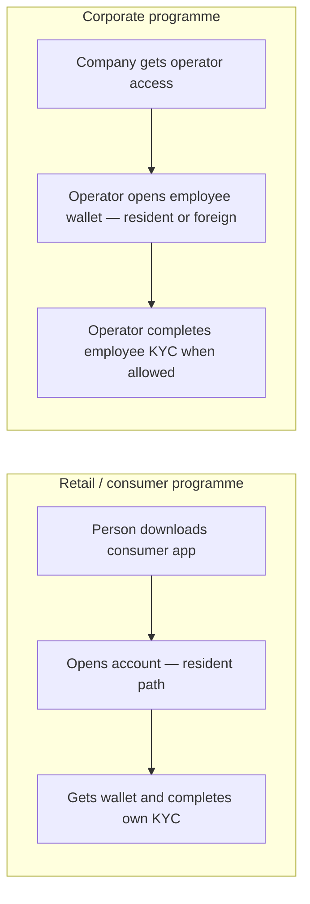

# Resident and foreign customers: retail vs corporate programmes

**Who this is for:** programme owners, product, compliance, and partner managers who need a **clear picture of who can be onboarded where**, how **foreign** participants enter the platform, and how **identity checks (KYC)** line up with **consumer** and **corporate** apps — without reading API specifications.

**In one sentence:** MITF Wallet treats **everyday retail customers** as **residents** onboarded through the **consumer** channel, while **foreign** individuals enter only as part of a **corporate-managed** relationship (for example an employee wallet), with **KYC** collected either by the **person themselves** or by their **employer’s operator**, depending on the channel.

!!! tip "Need technical depth?"
    Integrators and engineers should use the [Customer Gateway service reference](../reference/service-reference/Masarat.Gateway.Customer.Api.reference.md), [KYC flow, validation & portal approval](./kyc-flow-validation-and-portal-approval.md), and the **mitf_wallet** repository’s internal `personas-and-flows.md` for routes, headers, and payloads.

---

## Two ways the bank meets customers

MITF Wallet exposes two main **digital experiences** (each uses its own mobile or partner app credentials so the wrong app cannot call the wrong programme):

| Experience | Typical user | What the bank is offering |
| ---------- | ------------ | ------------------------- |
| **Consumer (retail) wallet** | Individual with a national ID–style identity in your market | A personal wallet: save, send, pay, cash-out, etc. |
| **Corporate wallet** | Company staff who run payroll or treasury on behalf of the business | **Operator** access: company wallets, **employee** wallets (resident or foreign staff), and optional pooled liquidity where you enable it |

**Merchant acceptance** (in-store or partner acceptance apps) is a third experience for **taking payments**; it follows the same broad money-movement rules as retail but does **not** include the **employer-led KYC path** for staff—that path lives on the **corporate** experience only.

---

## Resident vs foreign: what the words mean for the business

| Term | Plain meaning | Why it matters |
| ---- | --------------- | -------------- |
| **Resident customer** | Someone your programme treats as a **domestic** individual (national ID–led onboarding in typical deployments) | This is who **retail self-sign-up** is built for. |
| **Foreign holder** | Someone your programme treats as **non-resident** for that wallet (often passport-led) | They **do not** appear from anonymous **retail** sign-up. They appear when the **company** adds them (for example as an **employee**). |
| **Wallet owner** | The person whose **balance** the wallet represents | Regulations and statements attach to this person. |
| **Who opened the wallet** | Often the **retail customer themselves**, or a **corporate operator** when the wallet is for an employee | The bank can grant **ongoing management** (fund, transact on behalf of, complete KYC) to that opener when your rules say so—typical for **employer–employee** setups. |

---

## The rules the platform enforces (policy in plain language)

1. **Retail onboarding creates residents only.**  
   The shared “open an account” journey for **consumer** and **corporate operator** apps is **not** a back door for **self-service foreign retail**. If a partner tried to force a “foreign retail” type through that journey, the platform **rejects** it—by design.

2. **Foreign individuals join through the employer.**  
   When a company creates an **employee wallet** and marks the employee as **foreign**, the platform creates that person through a **business-controlled** registration path (passport-style identity), then attaches the wallet. That keeps **foreign** entry tied to **programme and employer context**—better for **compliance, audit, and support**.

3. **Who completes KYC depends on who is logged in.**  
   - On the **consumer** app, the logged-in person completes **their own** KYC.  
   - On the **corporate** app, the **operator** completes **their own** KYC where required, and can also complete **KYC for an employee wallet they legitimately manage**—so a foreign worker is not blocked because they never log in to a consumer app your bank did not issue to them.

4. **Bank staff still review when you require it.**  
   Templates can require **manual approval** in the **Management Web** portal; apps collect data, **staff** approve or reject where your policy demands human eyes.

---

## How a journey feels (high level)

**Optional retail nuance:** some banks allow a **family** or **dependent** wallet where the **holder** is another **resident**; that remains a **consumer** story, not a corporate one.

---

## What to expect in product conversations

| Topic | Consumer programme | Corporate programme |
| ----- | ------------------- | --------------------- |
| **Who signs up first** | The individual | Usually the **company operator** (then employees are added) |
| **Foreign participant** | Not via generic retail sign-up | Yes — as **employee** (or similar) under company control |
| **Who fills KYC** | The individual | Operator for **self**; operator can file for **managed employees** where management permission applies |
| **Where staff configure products** | Management Web (classifications, templates, review queue) | Same — **not** where end-customers capture KYC day-to-day |

---

## Staff portal vs customer-facing apps

**Gateway Management Web** is the **bank’s back-office**: configure **wallet products**, **fee rules**, **KYC templates**, review **pending submissions**, search wallets and transactions.  

**Consumer and corporate apps** are where **end customers and operators** actually **open accounts**, **move money**, and **submit KYC fields**. The portal **does not replace** those apps for day-one capture—it **governs** what they can collect and **decides** when manual review is satisfied.

---

## For implementation teams (short)

Consumer and corporate apps call different **URL bases** on the same gateway technology; credentials must match the programme. **Technical route names** and **error shapes** are documented under [Customer Gateway service reference](../reference/service-reference/Masarat.Gateway.Customer.Api.reference.md). **KYC** mechanics (templates, validation, approval queue) are in [KYC flow, validation & portal approval](./kyc-flow-validation-and-portal-approval.md).

---

## Related material

| Audience | Link |
| -------- | ---- |
| Security and onboarding abuse | [Onboarding channel hardening](../security/onboarding-channel-hardening.md) |
| KYC templates, validation, staff approval | [KYC flow, validation & portal approval](./kyc-flow-validation-and-portal-approval.md) |
| Engineers — gateway host and headers | [Customer Gateway service reference](../reference/service-reference/Masarat.Gateway.Customer.Api.reference.md) |
| Engineers — KYC service | [KYC API service reference](../reference/service-reference/Masarat.Kyc.Api.reference.md) |
| Engineers — staff portal | [Gateway Management Web service reference](../reference/service-reference/Masarat.Gateway.Management.Web.reference.md) |

The **mitf_wallet** source repository contains the live product implementation and an optional **Flutter gateway tester** for QA walkthroughs.
