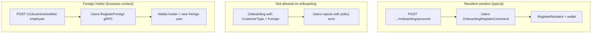

# Residents, foreign holders, and Customer Gateway personas

This page explains how **resident** and **foreign** identities interact with the **Customer Gateway** (`Masarat.Gateway.Customer.Api`): the **`/v1/customer`** and **`/v1/business`** bases (and briefly **`/v1/merchant`**), how users are **created**, how **wallets** bind **holders** and **creators**, and how **KYC** is collected for the **JWT user** versus a **managed employee**.

It mirrors **mitf_wallet** behaviour: **public onboarding is resident-only**; **foreign users** are created through **business-managed** registration (not `OnboardingRegisterCommand` with `CustomerType=Foreign`); **managed-holder KYC** exists only under **`/v1/business`**.

!!! tip "Related reading"
    [Onboarding channel hardening](../security/onboarding-channel-hardening.md) (abuse controls), [Customer Gateway service reference](../reference/service-reference/Masarat.Gateway.Customer.Api.reference.md) (headers, hosts), [KYC API service reference](../reference/service-reference/Masarat.Kyc.Api.reference.md), and in **mitf_wallet**: `personas-and-flows.md`, `docs/solutions/kyc-user-status-vs-template.md`.

---

## Who uses which base path?

The gateway binds each registered **bank app** (`CustomerGateway:Apps[]`) to an **`AppType`** string. That type must match the **URL prefix** or the call is rejected (**403 Forbidden**): a **business** app cannot call **`/v1/customer/...`**, and a **customer** app cannot call **`/v1/business/...`**.

| `AppType` (config) | Base path | Primary audience |
| ------------------ | --------- | ---------------- |
| `customer` | `/v1/customer` | Retail / consumer wallet apps |
| `business` | `/v1/business` | Corporate operators (employees, self wallets, optional pools) |
| `merchant` | `/v1/merchant` | Acceptance / POS-style apps (shared money APIs; **no** managed-holder KYC routes) |

**Merchant note:** **`/v1/merchant`** exposes the same **shared** KYC routes as customer (`POST /kyc/submit`, `GET /kyc/status`) for the **authenticated merchant user** only. **`/kyc/managed/*`** is registered **only** on the **business** map — do not point merchant integrations at managed-holder KYC.

---

## Terms (data model)

| Term | Meaning |
| ---- | ------- |
| **Resident** | `CustomerType.Resident` in **Users** — national ID–oriented identity for typical retail onboarding. |
| **Foreign** | `CustomerType.Foreign` in **Users** — passport / national ID number used as the foreign holder’s primary identifier in registration APIs. |
| **Holder** | The **Users** id that **owns** the wallet row in **Wallets** (`UserId` / holder user id on summaries). This is who the balance belongs to. |
| **Creator** | The user id stored as **`CreatedByUserId`** on the wallet — who opened the wallet (often the **business operator** for employee wallets). |
| **Creator management access** | A boolean on the wallet: when **true** and the creator differs from the holder, the creator remains in the **management** lane (list wallets, fund where policy allows, transactions as “manager”, **and** business-only managed KYC for that holder). |

**Wallets service listing:** When a user calls “list my wallets”, the API returns wallets where they are the **holder** *or* they are the **creator** with **creator management access** enabled for that row — so operators see **employee** wallets alongside their own.

---

## How users become “resident” vs “foreign”

| Path | Service | Result |
| ---- | ------- | ------ |
| **Consumer or business operator onboarding** | `POST /v1/customer/...` or `POST /v1/business/...` **`onboarding/accounts`** → **Users** | **Resident** user (and associated wallet orchestration via gateway/Users). **`CustomerType=Foreign` is invalid** for this command. |
| **Direct Users API** (if exposed in your deployment) | Same **OnboardingRegisterCommand** semantics | Still **resident-only** for this command — do not use it to invent foreign retail sign-up. |
| **Employee wallet with foreign holder** | **Customer gateway** business wallet creation → **Users** `RegisterForeign` (or existing holder id) | **Foreign** user created **only** in this **business-managed** flow (passport + name, etc.), then wallet with `holderType` foreign. |

The exact wording of validation errors may vary by release; integrators should treat **foreign** as **unsupported** on **onboarding** and implement **business** employee flows for foreign staff.

---

## Customer persona — `/v1/customer`

### Audience

End users on a **consumer** banking app (`AppType: customer`).

### Onboarding (no JWT)

- **`POST /v1/customer/onboarding/accounts`** — Registers a **resident** and drives initial wallet / provisioning behaviour through the gateway and **Users**.
- **Headers:** Bank app identity (`X-App-Id`, `X-App-Key`, etc.) and optional bank override where configured — see [API reference](../reference/api.md).
- **Do not send `CustomerType=Foreign` expecting success** — the **Users** application layer rejects it for onboarding.

### Wallets (JWT)

| Route | Purpose |
| ----- | ------- |
| `POST /v1/customer/wallets` | **Self** wallet — holder = JWT user. |
| `POST /v1/customer/wallets/relations` | **Relation** wallet — holder = another **resident** you register or link; you remain the **creator** per policy. |

### KYC (JWT = always the logged-in customer)

| Route | Purpose |
| ----- | ------- |
| `POST /v1/customer/kyc/submit` | Submit field values for **`templateKey`** for the **authenticated user** only. |
| `GET /v1/customer/kyc/status?templateKey=...` | Template shape, missing keys, cleared flag — still **only** for the **JWT user**. |

There is **no** `/kyc/managed/*` on the customer base path. A parent cannot complete **KYC for a relation child** through these routes unless the product logs in **as** that child (not covered here). Product decisions for “dependent KYC” belong in a separate backlog if required.

**Choosing `templateKey`:** It must align with the **wallet classification** tied to the product (e.g. `resident-standard`, `resident-employer-issued`). Wrong keys return “template not found” style errors from **KYC**.

---

## Business persona — `/v1/business`

### Audience

Corporate **operators** (`AppType: business`).

### Operator onboarding (no JWT)

- **`POST /v1/business/onboarding/accounts`** — Creates the **operator** user (resident). This is **not** bulk employee import.

### Wallets (JWT)

| Route | Purpose |
| ----- | ------- |
| `GET /v1/business/wallets` | Lists wallets the operator may act on (self + managed rows per **Wallets** visibility rules). |
| `POST /v1/business/wallets/self` | Operator’s own corporate wallet. |
| `POST /v1/business/wallets` | **Employee** wallet — holder may be **Resident** or **Foreign**; may register a new user inline or attach an existing holder id per request contract. |

**Classification and KYC template pick:** Wallet classifications carry **resident** and **foreign** KYC template keys (and capture mode). The gateway picks the template for provisioning / KYC gating based on **holder type** and that classification — see **mitf_wallet** wallet classification model.

### KYC — two lanes

#### 1. Operator self (same as customer)

| Route | Holder |
| ----- | ------ |
| `POST /v1/business/kyc/submit` | JWT user (the **operator**). |
| `GET /v1/business/kyc/status?templateKey=...` | JWT user. |

Use this when the **bank** requires KYC on the **corporate user** themselves.

#### 2. Managed employee (business only)

| Route | Holder |
| ----- | ------ |
| `POST /v1/business/kyc/managed/submit` | Body **`holderUserId`** — must be an **employee** (or other wallet) the operator **manages**. |
| `GET /v1/business/kyc/managed/status?holderUserId=...&templateKey=...` | Same **`holderUserId`**. |

**Authorization rule (simplified):** The gateway loads wallets visible to the **JWT user** and allows managed KYC only if there exists a wallet where:

- `holderUserId` equals that wallet’s **holder**, **and**
- Either the JWT user **is** the holder (self — then you would normally use the non-managed route), **or** the wallet has **creator management access** and **`CreatedByUserId`** equals the JWT user (typical **employee** wallet created by this operator).

If the operator **cannot** see a managed wallet for that holder, the gateway responds with **403** and a short **not authorized** message — not a silent empty KYC body.

**Typical integrator sequence for a new foreign employee**

1. `POST /v1/business/wallets` with `holderType=Foreign` and passport fields → response includes **holder user id** when registration succeeds.
2. Resolve **`templateKey`** from your **classification** (often `foreign-standard` or `foreign-employer-issued` in dev seeds).
3. `GET /v1/business/kyc/managed/status?holderUserId=...&templateKey=...` — read **`missingFieldKeys`**.
4. `POST /v1/business/kyc/managed/submit` with JSON **`values`** until **`kycCleared`** (subject to manual review flags on the template).

---

## KYC service behaviour (cross-cutting)

For the **full** KYC model (templates vs field definitions, submit validation, status API, wallet capture modes, and **Management Web** `/kyc-review` approval), see [KYC flow, validation & portal approval](./kyc-flow-validation-and-portal-approval.md).

These rules are enforced in **Masarat.Kyc** and surface through gRPC to the gateway:

- **Inactive templates** do not accept new submissions and do not report **`kycCleared`** for gating, even if an old row was approved — deprecate templates carefully.
- **Field types** (string, date, number, boolean) are validated on submit so malformed payloads fail fast with a field-level error message.
- **Users `KycStatus`** (coarse flag on the user aggregate) is **not** the same thing as **per-template submission state**; wallet flows rely on **KYC submission status** for the relevant template. See **mitf_wallet** `docs/solutions/kyc-user-status-vs-template.md`.

---

## Staff portal vs runtime apps (Management Web)

**Gateway Management Web** (Blazor staff portal) is for **bank operators**: classifications, fee rules, KYC template CRUD, pending review queues, wallet search, etc. It is **not** a substitute for **customer** or **business** mobile apps:

- **Sub-wallet creation for end customers** and **managed-holder KYC capture** happen through **Customer Gateway** **`/v1/business`** (and customer **`/v1/customer`** for self/relation), not through Management Web screens.
- Staff **approve** or **reject** submissions in Management Web after data was submitted from apps (or tests).

---

## Money movement and “wrong wallet” confusion

Transaction endpoints resolve **wallet numbers** to ids and then enforce **actor access** in **Transactions** / **Wallets** (`CanBeAccessedBy`: holder **or** creator with management access). If a **resident** app tries to fund a wallet they do not hold and do not manage, downstream checks fail with an authorization-style error — the gateway forwards the failure. When debugging, always check **wallet list** for the JWT user and whether **`creatorHasManagementAccess`** is true for that employee wallet.

---

## Quick integrator checklist

| Check | Customer `/v1/customer` | Business `/v1/business` |
| ----- | ---------------------- | ------------------------ |
| Correct **`AppType`** and base URL | Required | Required |
| Onboarding only for **resident** retail / operator | Yes | Yes |
| Foreign **employee** | N/A (use business app) | `POST /wallets` with foreign path |
| KYC for logged-in user | `/kyc/submit`, `/kyc/status` | Same |
| KYC for **employee** | Not supported via managed routes | `/kyc/managed/submit`, `/kyc/managed/status` |
| After employee create, persist **`holderUserId`** from JSON | — | Required for managed KYC |

---

## Related material

| Topic | Where |
| ----- | ----- |
| Customer Gateway host and headers | [Customer Gateway service reference](../reference/service-reference/Masarat.Gateway.Customer.Api.reference.md) |
| Onboarding abuse and keys | [Onboarding channel hardening](../security/onboarding-channel-hardening.md) |
| Users HTTP surface | [Users API service reference](../reference/service-reference/Masarat.Users.Api.reference.md) |
| KYC gRPC | [KYC API service reference](../reference/service-reference/Masarat.Kyc.Api.reference.md) |
| Wallets / summaries | [Wallets API service reference](../reference/service-reference/Masarat.Wallets.Api.reference.md) |
| In-repo developer narrative | **mitf_wallet** — `src/Masarat.Gateway/Masarat.Gateway.Customer.Api/personas-and-flows.md` |

The **mitf_wallet** repo includes **`mobile/gateway_tester`**: guided **resident** and **business** tracks with **KYC** and **managed-holder KYC** steps for manual QA against a running stack.
