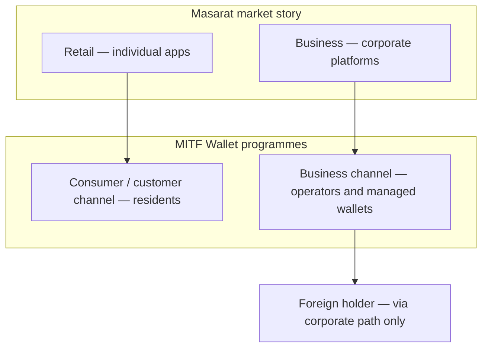

# Masarat customer segments: retail, business, and foreign participants

**Audience:** product, leadership, and partners. Technical routes and headers are in [architecture personas](../architecture/resident-and-foreign-gateway-personas.md) and the [Customer Gateway reference](../reference/service-reference/Masarat.Gateway.Customer.Api.reference.md).

**MITF Wallet** is the wallet, ledger, gateway, and KYC layer banks place behind their own brands. The segments below describe **who** those programmes serve.

---

## Three segments

| Segment | Who | MITF Wallet focus |
| ------- | --- | ------------------ |
| **Retail / individuals** | Consumers: personal balance, P2P, bills, cash-out, merchant pay | **Resident-led** self-onboarding on the **customer** channel; the holder completes their own KYC |
| **Business / corporate** | Companies running treasury, payroll, or multi-wallet work | **Business** channel; operators onboard as business users, then create and manage wallets (including managed-holder KYC where policy allows) |
| **Foreign (non-resident) holders** | Individuals not treated as domestic residents (often passport-led) | Enter only when **corporate** adds them (e.g. as an employee) — not via generic retail self-sign-up |

---

## Rules of thumb for bank conversations

1. **Retail** = **consumer** channel: national-ID-style domestic individuals — your mass-market story.
2. **Corporate** = **business** channel: company operators and the wallets they're permitted to open.
3. **Foreign individuals** are a **subset of people**, not a third public app persona — they appear when corporate legitimately introduces them under managed registration and KYC rules.

---

## Read next

| Need | Page |
| ---- | ---- |
| Policy, KYC, and channel behaviour | [Resident and foreign customers](../architecture/resident-and-foreign-gateway-personas.md) |
| KYC templates, validation, staff approval | [KYC flow, validation & portal approval](../architecture/kyc-flow-validation-and-portal-approval.md) |
| Onboarding abuse boundaries | [Onboarding channel hardening](../security/onboarding-channel-hardening.md) |
| Executive product story | [Executive & business overview](../stakeholders/executive-overview.md) |
