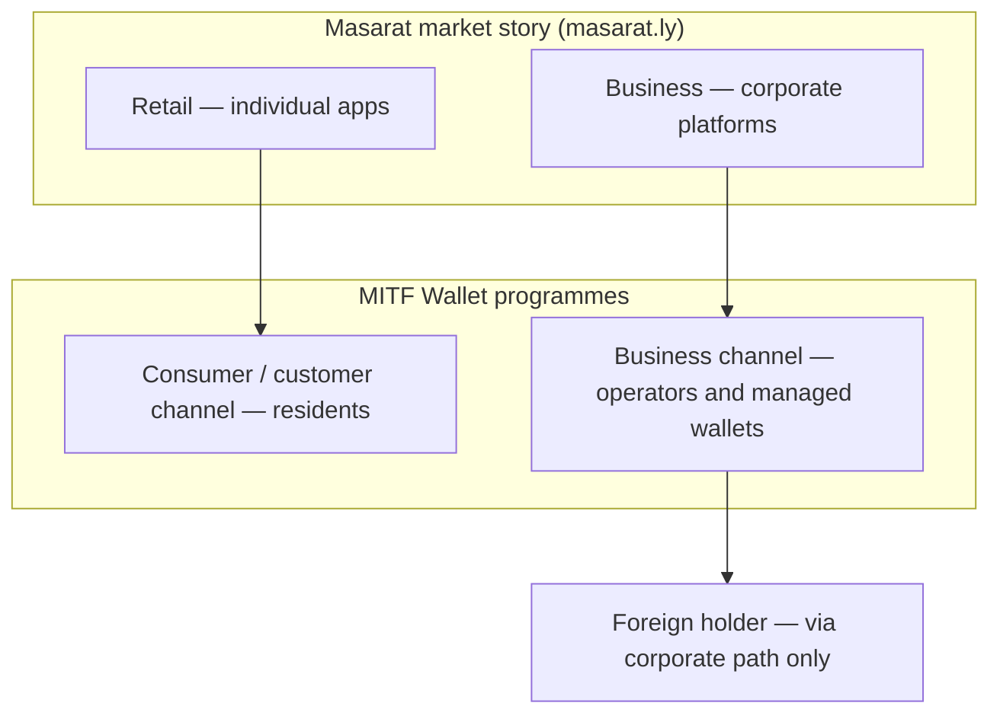

# Masarat customer segments: retail, business, and foreign participants

This page aligns **MITF Wallet** documentation with how **[Masarat](https://masarat.ly/)** describes its work in the market: **retail banking for individuals**, **corporate and institutional banking**, plus how **foreign (non-resident) individuals** fit when a bank runs this stack. It is written for **product, leadership, and partners**; technical routes and headers live in the [architecture personas page](../architecture/resident-and-foreign-gateway-personas.md) and the [Customer Gateway service reference](../reference/service-reference/Masarat.Gateway.Customer.Api.reference.md).

---

## How this maps to Masarat’s public proposition

On [masarat.ly](https://masarat.ly/), Masarat presents integrated technology for banks and regulated partners: **individual banking apps** (transfers, bill pay, everyday money), **corporate digital platforms** (multi-account management, payroll-style automation), **merchant payments**, **unified payment networks**, **remote identity verification**, and **smart / self-service channels**. **MITF Wallet** is the **wallet, ledger, gateway, and KYC orchestration layer** banks can place behind their own brands and apps—so the segments below are **who** those programmes serve, not a separate product list.

---

## Three segments (plain language)

| Segment | Who they are | What MITF Wallet is optimising for |
| ------- | ------------ | ----------------------------------- |
| **Retail / individuals** | People using a **consumer** banking or wallet experience: personal balance, P2P, bills, cash-out, merchant pay, etc. | **Resident-led** self onboarding on the **customer** gateway channel; the holder completes **their own** KYC in the consumer journey. |
| **Business / corporate** | Companies and **operators** who run **treasury, payroll, or multi-wallet** work on behalf of the firm: company wallets, employee wallets, optional pooled liquidity. | **Business** gateway channel; operators onboard as **business users**, then create and manage wallets (including **managed-holder** KYC where policy allows). |
| **Foreign (non-resident) holders** | Individuals who are **not** treated as domestic residents for a given wallet (often passport-led identity). | **Not** created through generic **retail** self-sign-up. They enter when **corporate** adds them in context—typically as an **employee** (or similar managed relationship)—so foreign participation stays **employer- and programme-bound** for compliance and audit. |

---

## One picture

---

## Rules of thumb for conversations with banks

1. **Retail** maps to the **consumer** channel: design for **national-ID-style** domestic individuals in typical deployments; this is your **mass-market retail** story.  
2. **Corporate** maps to the **business** channel: design for **company operators** and the wallets they are allowed to open (self, employee, pools if enabled).  
3. **Foreign individuals** are a **subset of people** who may hold wallets, not a third “public app” persona for anonymous sign-up: they appear when **corporate** legitimately introduces them, with **managed** registration and KYC rules as documented.

---

## Read next

| Need | Page |
| ---- | ---- |
| **Policy, KYC, and channel behaviour (business depth)** | [Resident and foreign customers: retail vs corporate programmes](../architecture/resident-and-foreign-gateway-personas.md) |
| **KYC templates, validation, staff approval** | [KYC flow, validation & portal approval](../architecture/kyc-flow-validation-and-portal-approval.md) |
| **Onboarding abuse boundaries** | [Onboarding channel hardening](../security/onboarding-channel-hardening.md) |
| **Executive product story** | [Executive & business overview](../stakeholders/executive-overview.md) |
