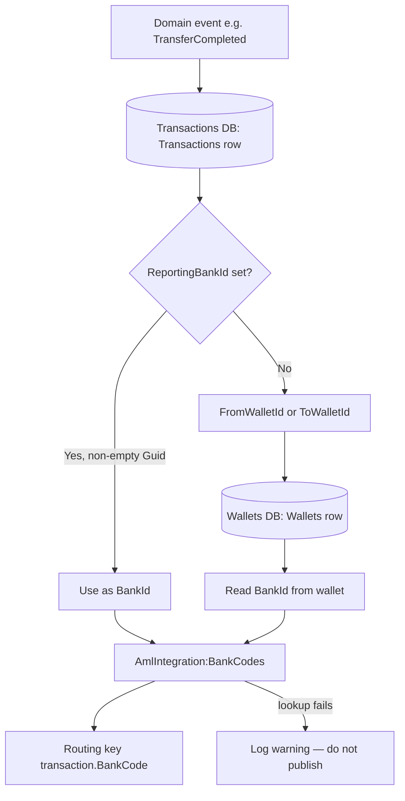

# AML bridge — tenant (`BankId`) resolution {: .wallet-lead }

Domain events consumed by `Masarat.AmlBridge` do not carry a bank tenant. The bridge resolves **which bank** a transaction belongs to for the correct FlowGuard routing key: `transaction.{BankCode}`.

## Resolution flow

## Algorithm

1. Load the row from `masarattransactions` table `"Transactions"` for the wallet transaction id.
2. If `"ReportingBankId"` is set and not the zero GUID, use it as `BankId`.
3. Otherwise take `"FromWalletId"` if set, else `"ToWalletId"`.
4. Look up that wallet id in `MasaratWallets` table `"Wallets"` and read `"BankId"`.

If any step fails (missing row, no wallet id, wallet not found), the bridge **logs a warning** and **does not publish**.

## Configuration

Map each resolved `BankId` (Guid) to a FlowGuard string code in `AmlIntegration:BankCodes` (see `appsettings.json` and `docker-compose.yml` for `masarat.aml.bridge`).
