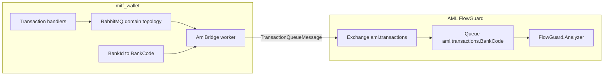

# FlowGuard (AML) integration — Masarat wallet {: .wallet-lead }

**Publish path:** domain completion events → bridge worker → topic `aml.transactions` / `transaction.{BankCode}` → FlowGuard analyzer. No synchronous screening on `PostJournal` in this phase.

## AML repository (source of truth)

| Item | Location |
| ---- | -------- |
| AML repo root (local clone) | `C:\Users\a.mesbahi\Desktop\AMLSystem` |
| Contract and vocabulary | `AMLSystem/docs/integrations/masarat-wallet-flowguard-integration.md` |
| Operations (RabbitMQ, DLQ, TLS, HTTP ingress) | `AMLSystem/docs/operations/aml-transaction-queue-runbook.md` |
| Automated contract tests | `AMLSystem/src/Tests/FlowGuard.Services.Analyzer.Tests` |

The wallet team should treat the AML integration document as **normative**: message shape, routing keys, channel and transaction type strings, and validation rules are owned by AML.

---

## Objectives

1. **Coverage:** After successful money movement, FlowGuard receives an analyzable record.
2. **Decoupling:** Keep transaction/ledger commit paths free of synchronous AML calls.
3. **Consistency:** Use the same RabbitMQ topic path FlowGuard.Analyzer already consumes.
4. **Operability:** Least-privilege credentials, clear observability, repeatable non-prod validation.

## Non-goals

- Pre-commit blocking or "hold funds until AML OK."
- Changing FlowGuard scoring rules.
- Replacing partner webhooks — `Masarat.Webhooks` remains for per-wallet subscriptions.
- Defining downstream alert or case handling.

---

## Architecture

`Masarat.AmlBridge` worker:

1. **Subscribes** to wallet domain completion events on the same RabbitMQ / MassTransit setup.
2. **Maps** each event to `TransactionQueueMessage`.
3. **Publishes** to topic exchange `aml.transactions` with routing key `transaction.{BankCode}`.

**Why a bridge?** Isolates AML broker credentials, topology changes, and release cadence from core Transactions. Easier to disable, throttle, or extend without touching hot paths.

---

## Event inventory (Phase 0 audit)

| Event | Emitted from | AML scope | Key mapping fields |
| ----- | ------------ | --------- | ------------------ |
| `TransferCompletedEvent` | `TransferBetweenWalletsHandler`, repair paths | In scope | `TransactionId`, `FromWalletId`, `ToWalletId`, `Amount`, `Currency`, `Fee` |
| `WalletFundedEvent` | `FundWalletFromCurrentAccountHandler`, `FundWalletFromPooledAccountHandler`, repair paths | In scope | `TransactionId`, `WalletId`, `Amount`, `Currency`, `FundedAt` |
| `MerchantPaymentCompletedEvent` | `ProcessMerchantPaymentHandler`, repair paths | In scope | `TransactionId`, `WalletId`, `Amount`, `Fee`, `Currency`, `MerchantReference` |
| `CashWithdrawalCompletedEvent` | `ProcessCashWithdrawalHandler`, repair paths | In scope | `TransactionId`, `WalletId`, `Amount`, `Fee`, `Currency` |
| `TransactionReversedEvent` | `ReverseTransactionHandler`, repair paths | In scope | `ReversalTransactionId`, `OriginalTransactionId`, `FromWalletId`, `ToWalletId`, `Amount`, `Fee` |
| `WalletCreatedEvent` | Wallet creation | Out of scope | Not a movement event |
| `WalletClassificationDeactivatedEvent` | Wallet classification admin | Out of scope | Not a movement event |

**Findings:**
- All in-scope events omit `BankId`. Derivation path: every event has a stable `TransactionId` that resolves to `Transactions.Transaction.ReportingBankId` (set during command handling).
- Repair services republish the same events via `RepairEventFactory` — bridge must handle replayed events identically.
- `MerchantReference` is optional; AML mapping should default safely.

**Phase 0 decisions:**
1. Use transaction lookup by id and `Transaction.ReportingBankId` as primary `BankId` source (wallet fallback as safety net).
2. **Defer dual-publish** for inter-bank P2P — publish one AML message for the source bank in current phase.
3. Direct read from Transactions DB for tenant resolution in Phase 1.

---

## Delivery semantics

- **At-least-once delivery**: bridge may see duplicate domain messages.
- **AML business key**: FlowGuard upserts by stable `transaction.transactionId` (wallet GUID). Retries must not mint new transaction ids for the same wallet transaction.
- **Envelope `messageId`**: distinct from `transactionId`. Recommended default: new GUID per publish attempt.

---

## Contract summary (must match AML)

| Concern | Requirement |
| ------- | ----------- |
| **Transport** | RabbitMQ topic exchange `aml.transactions`; routing key `transaction.{BankCode}` |
| **Envelope** | `TransactionQueueMessage`: `messageId`, `timestamp`, `bankCode`, `messageVersion` (`1.0`), nested `transaction` |
| **Payload** | `TransactionAnalysisRequest`: amount > 0; currency ISO 4217 uppercase; `transactionDate` UTC, non-default, within validator clock-skew window |
| **Bank alignment** | Envelope `bankCode` and inner `transaction.bankCode` must match analyzer `TenantConfig:BankCode`; mismatch is rejected (DLQ) |
| **Idempotency** | Stable `transaction.transactionId` for the same wallet transaction across retries |
| **JSON** | `System.Text.Json` camelCase |
| **Channel** | `WALLET` |
| **TransactionType** | `WALLET_TRANSFER`, `WALLET_FUND`, `MERCHANT_PAYMENT`, `CASH_WITHDRAWAL`, `WALLET_REVERSAL` (reversals use positive amount) |

---

## Event to AML mapping

| Wallet event | `transactionType` | Notes |
| ------------ | ------------------ | ----- |
| `TransferCompletedEvent` | `WALLET_TRANSFER` | `accountNumber` = from wallet id; `beneficiaryAccount` = to wallet id |
| `WalletFundedEvent` | `WALLET_FUND` | `accountNumber` = funded wallet id |
| `MerchantPaymentCompletedEvent` | `MERCHANT_PAYMENT` | `accountNumber` = payer wallet; merchant reference in `productId` / `description` if available |
| `CashWithdrawalCompletedEvent` | `CASH_WITHDRAWAL` | `accountNumber` = wallet id |
| `TransactionReversedEvent` | `WALLET_REVERSAL` | Positive `amount`; original id in `correlationId` / `description` per AML guidance |

`channel` = `WALLET` for all rows.

---

## Configuration (bridge host)

| Setting | Purpose |
| ------- | ------- |
| `Enabled` | Kill-switch without redeploying other services |
| `RabbitMq` | Host, port, vhost, user, password, TLS |
| `FlowGuard:ExchangeName` | Default `aml.transactions` |
| `FlowGuard:RoutingKeyTemplate` | `transaction.{BankCode}` |
| `BankCodeMap` | Wallet `BankId` (GUID) → AML `BankCode` |

Secrets via environment variables or secret store — not committed appsettings.

---

## Environment matrix (ops)

| Environment | Wallet `BankId` | AML `BankCode` | RabbitMQ host | FlowGuard instance |
| ----------- | --------------- | -------------- | ------------- | ------------------ |
| Dev | … | … | … | … |
| Staging | … | … | … | … |
| Production | … | … | … | … |

---

## MassTransit checklist

- Durable queues for bridge receive endpoints.
- Receive endpoint naming consistent with existing MassTransit conventions.
- Retry policy for transient publish failures vs poison handling.
- Prefetch tuned to avoid starving other consumers.
- Same virtual host as other wallet publishers unless security mandates a split.

---

## PII and logging

- Follow data minimization: only fields required for monitoring.
- Avoid logging full payloads in production if they contain regulated data.
- Phase 2 enrichment (e.g. `CustomerId` from Users) is gated on privacy approval.

---

## Contract drift options

- **Option A:** Hand-maintained DTOs aligned to AML docs and contract tests.
- **Option B:** Shared package published from AML referencing `TransactionQueueMessage` types.

Record the chosen option in the bridge project README when implementation starts.

---

## Non-prod validation checklist (Phase 3)

1. Set `AmlIntegration__BankCodes__<bank-guid>=<BANKCODE>` in compose env.
2. Start: `docker compose up -d db rabbitmq masarat.ledger.api masarat.wallets.api masarat.transactions.api masarat.aml.bridge`
3. Trigger one transaction from each in-scope flow.
4. Confirm bridge logs show publish success and no tenant-resolution skips.
5. In RabbitMQ management, verify messages route to `aml.transactions` with key `transaction.<BANKCODE>`.
6. If FlowGuard non-prod is connected, verify analyzer consume success and no sustained DLQ growth.
7. On mismatch, inspect: bridge warning logs, AML analyzer bank mismatch errors, DLQ payloads.

## Security hardening checklist (Phase 4)

1. Create a dedicated RabbitMQ user + vhost for the bridge (no shared admin credentials).
2. Grant least-privilege: publish to `aml.transactions`; consume only wallet domain completion events.
3. Enable TLS (`UseSsl=true`) in non-prod/prod; verify broker certificate validation.
4. Add alerts: bridge publish failure rate, unresolved tenant/bank mapping warnings, AML DLQ depth.
5. Run failure drills: invalid bank mapping, broker unavailable, wrong-bank routing.

---

## Implementation order

1. **Phase 0 — Audit:** Event inventory; `BankId` coverage; document gaps.
2. **Phase 1 — Bridge scaffold:** Worker project, MassTransit consumers, options binding, feature flag.
3. **Phase 2 — Mappers and publish:** Full `TransactionQueueMessage` build; unit tests.
4. **Phase 3 — Compose and non-prod:** docker-compose wiring; validate with FlowGuard.Analyzer.
5. **Phase 4 — Hardening:** Dedicated RabbitMQ ACL, dashboards, optional enrichment.

## Definition of done

- All in-scope completion events produce at most one logical analysis per stable `transactionId`.
- No synchronous AML dependency in ledger commit.
- Published messages pass AML validator in non-prod (no systematic DLQ or bank mismatch).
- Runbook for ops: env vars, broker URL, how to disable, where AML logs rejections.

---

## Reference links

**mitf_wallet**

- [TransferCompletedEvent.cs](../../src/Masarat.MessagingContracts/Events/TransferCompletedEvent.cs)
- [docker-compose.yml](../../docker-compose.yml)

**AMLSystem**

- `docs/integrations/masarat-wallet-flowguard-integration.md`
- `docs/operations/aml-transaction-queue-runbook.md`
