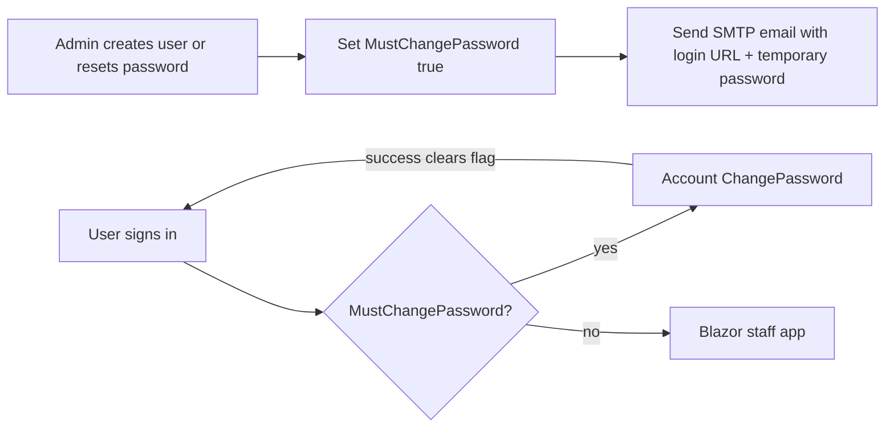

# Staff credential lifecycle (forced password change + credential email)

How the management portal (`Masarat.Gateway.Management.Web`) issues credentials to new staff and to staff whose passwords are reset by an administrator. Covers the `MustChangePassword` flag, the credential email, and the runtime gate.

---

## 1. End-to-end flow

1. Admin creates a user or resets a password from **Admin → Users**.
2. Portal sets `MustChangePassword = true`.
3. If email is enabled, portal sends a localized email with the sign-in URL and temporary password.
4. User signs in → redirected to `/Account/ChangePassword`.
5. User enters temporary password + new password. On success, flag is cleared; user is signed out and asked to log in with the new password.

The seeded bootstrap admin (`ManagementGateway:SeedAdmin`) is **not** flagged, so dev/local stacks work without ceremony.

---

## 2. Enforcement layers

| Layer | Location | Behavior |
| ----- | -------- | -------- |
| **Persistence** | `AspNetUsers.MustChangePassword` (`boolean`, default `false`) | Source of truth |
| **Admin "Create user"** | `/admin/users/create` | Sets the flag; optionally emails credentials |
| **Admin "Reset password"** | `/admin/users/{id}` | Sets the flag; optionally emails the new password |
| **Login (password)** | `/Account/Login` | After `PasswordSignInAsync`, redirects to `/Account/ChangePassword` when flag is set |
| **Login (2FA)** | `/Account/LoginWith2fa` | Same redirect after successful authenticator code |
| **Global gate** | `MustChangePasswordMiddleware` | Catches all authenticated requests (existing cookie, secondary tab, deep link) |
| **Change password** | `/Account/ChangePassword` | On success clears the flag, signs the user out |

### Path allowlist

- **Exact:** `/Account/Login`, `/Account/Logout`, `/Account/LoginWith2fa`, `/Account/AccessDenied`, `/Account/ChangePassword`, `/health`, `/health/ready`, `/manifest.webmanifest`, `/management-theme.js`, `/pwa-register.js`
- **Prefixes:** `/_framework/`, `/_blazor`, `/_content/`, `/css/`, `/js/`, `/fonts/`, `/branding/`, `/images/`, `/lib/`, `/culture/`

All other authenticated requests redirect to `<PathBase>/Account/ChangePassword?returnUrl=<original path + query>`.

---

## 3. Outbound email

Single SMTP email via MailKit. Body contains:
- Localized intro (creation vs reset).
- User's email and temporary password in code-styled boxes.
- Link to the public sign-in URL (`OutboundEmail:PublicBaseUrl` + `PathBase` + `/Account/Login`).
- Password policy reminder and security note.

**Silent conditions:**
- `OutboundEmail:Enabled = false` (default) — no message sent; admins see a warning to share the password manually.
- Required fields missing (`Host`, `FromEmail`) — logs Error; admin gets warning snackbar.
- SMTP failure — logged at Error; warning surfaced in admin UI.

The portal **never blocks** user creation or password reset when email cannot be delivered.

### Configuration (`ManagementGateway:OutboundEmail`)

| Key | Type | Example | Description |
| --- | ---- | ------- | ----------- |
| `Enabled` | `bool` | `true` | Master switch |
| `Host` | `string` | `smtp.example.com` | SMTP relay; required when enabled |
| `Port` | `int` | `587` | SMTP port |
| `UseStartTls` | `bool` | `true` | Use STARTTLS |
| `Username` | `string?` | `smtp-user` | Optional SMTP auth user |
| `Password` | `string?` | `smtp-secret` | SMTP auth password — treat as secret |
| `FromEmail` | `string` | `no-reply@masarat.example` | Required envelope/from address |
| `FromName` | `string?` | `Masarat Management Portal` | Optional display name |
| `PublicBaseUrl` | `string?` | `https://management.example.com` | Absolute URL for email links; required behind reverse proxies |

---

## 4. Admin UX

Both admin pages add:
- **Checkbox** "Email credentials to the user" (default on).
- **Inline hint** that the user will be required to choose a new password on first sign-in.
- **Snackbar warning** when email send fails (the user/password operation still succeeds).

Reset password page: only emails after the flag write succeeds — a user is never emailed a temporary password without the gate active.

---

## 5. Operational guidance

- **Default:** Ship with `OutboundEmail:Enabled=false`; admins share temporary passwords manually.
- **Production:** Enable SMTP, set `PublicBaseUrl` to the public hostname, verify the email link opens the correct login page.
- **Reverse proxies:** If portal is at `/management`, set `PublicBaseUrl=https://portal.example.com` (app appends its own `PathBase`).
- **Auditability:** `management_staff_audit_events` captures admin actions ("who reset whom").
- **Lockout interaction:** Lockout blocks login independently. A locked user with `MustChangePassword=true` must have lockout cleared by admin before signing in.
- **2FA:** Gate runs after second factor succeeds — user proves both temporary password and authenticator before choosing a new password.

---

## 6. Database

| Property | PostgreSQL | Default | Description |
| -------- | ---------- | ------- | ----------- |
| `MustChangePassword` | `boolean`, NOT NULL | `false` | Forces change-password page before any other portal page |

Migration: `AddMustChangePasswordToUser`. Runs on startup via `ManagementDbContext`. No backfill needed.

---

## 7. Threats addressed

**Addressed:**
- Long-lived admin-issued passwords that staff never rotate.
- Casual lateral access by anyone who saw a temporary password.
- Operator forgetting to deliver credentials — email creates an auditable artifact.

**Out of scope:**
- **Password mailbox compromise.** Plain-text credentials in email are weaker than a one-time reset link. Revisit if your threat model requires link-only flow.
- **MFA enrollment.** Does not enforce authenticator enrollment before first portal use — combine with `ManagementGateway:EnableAuthenticatorEnrollment` and operational policy.
- **Password breach reuse.** ASP.NET Core Identity validators enforce length/classes; subscribe to a breached-password feed if policy requires it.
