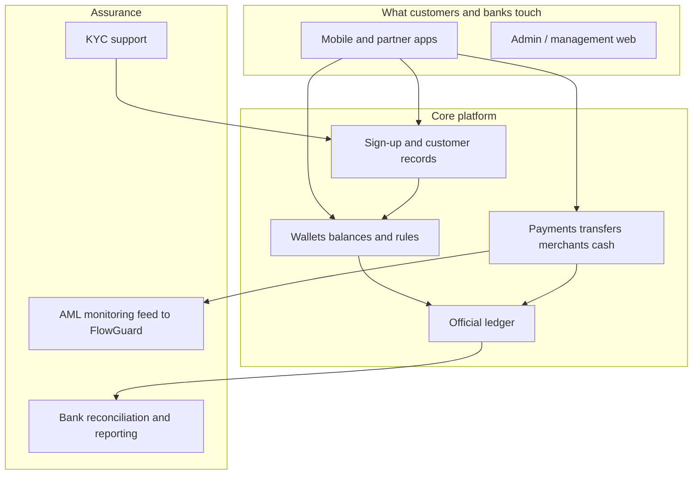

# Masarat MITF Wallet — platform at a glance {: .wallet-lead }

**Masarat Wallet** powers **digital wallets** for banks and regulated partners: onboarding, balances, P2P and merchant payments, cash-out, and pooled/treasury accounts — with a **single official ledger** so money and reporting stay trustworthy.

This page is for **leaders and business owners** at Masarat. Engineers will find APIs, architecture, and runbooks elsewhere.

---

## What leadership should know

| What matters | In plain terms |
| ------------ | -------------- |
| **Correct money** | Movements recorded in a proper accounting-style ledger so debits and credits stay balanced. Repeated or retried requests do not create double payments. |
| **Ready for bank apps** | A front door designed for mobile and partner channels: secure access per app, optional login for end users, controls on call rate. |
| **Reliable messaging** | When a payment is saved, related notifications are designed to go out reliably after the payment commits. |
| **Capacity (internal tests)** | In Masarat's internal lab, the stack sustained **roughly tens to low hundreds of wallet payments per second**, including fault-injection runs. Figures are for planning, not a customer contract — see the [short summary](../load-testing/stakeholder-load-test-summary.md). |
| **Compliance monitoring** | After money movements complete, the platform sends standardised monitoring data to **FlowGuard** (Masarat's AML side) without blocking the payment. |
| **Run the bank** | Dashboards, logs, and **reconciliation** tools to compare the ledger with bank statements. |

---

## How the pieces fit

---

## Who should read which page

| If you… | Go here |
| ------- | ------- |
| Own strategy, commercial, or the business case | [Executive & business overview](executive-overview.md) |
| Own risk, compliance, AML, audit, or finance control | [Risk, compliance & finance](risk-compliance-and-finance.md) |
| Own IT delivery, infrastructure, or day-to-day operations | [Operations & technology leadership](operations-and-technology.md) |
| Need APIs, diagrams, and implementation detail | [Welcome & guided tours](../getting-started/welcome.md) · [Full A–Z index](../getting-started/all-pages.md) |

---

## Proof points (internal lab — not an SLA)

Masarat has run large-scale internal tests (including deliberate failures and duplicates). The system **completed planned volumes**, **handled retries predictably**, and **checked balances against the ledger**. Numbers and caveats: [stakeholder load test summary](../load-testing/stakeholder-load-test-summary.md). Production performance depends on your environment.

---

1. Bookmark this page as the leadership entry to the docs.
2. Send product and delivery teams to [Welcome & guided tours](../getting-started/welcome.md) when they need specifications and depth.
